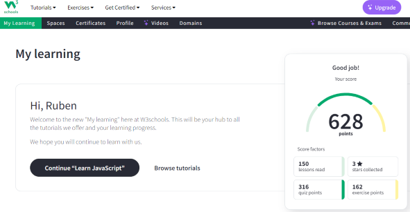

# Document

## Header
### Rsschool cv

- About
- Contact me
- Skills

## Ruben Martirosyan
Junior Frontend Developer
- About myself
  - Date of birth 09/06/1992
  - Hi I am Ruben, from Yerevan Armenia
  - As a passionate and driven Front-End Developer intern, I am excited to bring my skills in Bootstrap, jQuery, Express.js, Node.js, GSAP, and Figma to contribute to impactful projects and continue learning from seasoned professionals. With a strong foundation in HTML, CSS, and JavaScript, I am eager to collaborate with a dynamic team to create responsive and visually appealing websites, while also building robust back-end systems to power efficient

## Skills
- Figma
- Html
- Css
- Bootstrap
- Javascript
- JQuery
- Git
- Node Js
- express Js
- API
- SQL
- MongoDB
- Mongoose
- Python

## One of my works
[Article preview component](https://rubboss.github.io/article-preview-component-master/)

## Education
### Bachelor
Yerevan State University
Yerevan / From 2014 to 2019
Faculty of Geography and Geology
Service

### Udemy
Web3 course

### Tumo Labs

### Epam
Front-End Self-Paced Online Program

## W3schools

## Code example
function calculateSum(a, b) {
return a + b;
}

const num1 = 5;
const num2 = 3;
const sum = calculateSum(num1, num2);
console.log("The sum of", num1, "and", num2, "is", sum);

## Soft skills
- People and interpersonal
- Time management
- Open-Mindedness
- Problem-Solving
- Self-learning
- Teamwork

## Languages
- Armenian
- Russian
- English B1

## Interests and hobby
- SPORT(Swimming Diving Running Walking) Nature
- Machines
- Movies
- Music
- Games

## Contact me
- Phone: +37493222207
- E-mail: rubboss1992@gmail.com
- 

## Footer

2023

